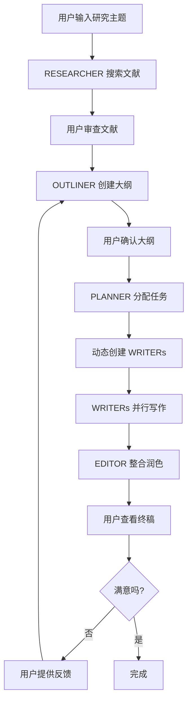

# 多智能体学术论文写作助理 - 产品需求文档 (PRD)

## 文档信息

| 项目 | 内容 |
|------|------|
| 产品名称 | ScholarGrid AI - Multi-Agent Academic Writing Assistant |
| 版本 | v1.0.0 |
| 创建日期 | 2025-02-07 |
| 最后更新 | 2025-02-07 |
| 文档状态 | 初稿 |
| 作者 | Claude & Product Team |

---

## 1. 产品概述

### 1.1 产品愿景

ScholarGrid AI 是一个基于**多智能体协作**的学术论文写作助手，采用 Agency Swarm 架构理念，通过多个专业化 AI 智能体协同工作，帮助研究者从文献调研到论文定稿的全流程自动化。

### 1.2 核心价值主张

- **🤖 多智能体协作**: 模拟真实学术团队，每个智能体扮演特定角色（研究助理、架构师、规划师、写作专员、编辑）
- **💬 透明化协作过程**: 可视化智能体间的对话和决策过程，用户可随时了解工作进展
- **🔄 迭代式工作流**: 支持用户在各阶段介入调整，智能体会根据反馈优化输出
- **📊 结构化产出**: 从文献到大纲，从任务分配到章节写作，全程保持结构化数据

### 1.3 目标用户

| 用户群体 | 痛点 | 价值 |
|---------|------|------|
| **硕博研究生** | 文献量大、写作经验不足、时间紧迫 | 快速梳理文献、生成大纲、完成初稿 |
| **青年教师** | 论文发表压力大、跨领域研究需求多 | 提高写作效率、保证学术规范 |
| **科研人员** | 需要快速产出综述、探索新方向 | 快速调研、整合信息、生成框架 |
| **跨学科研究者** | 不熟悉特定领域写作规范 | 自动适配不同学科风格 |

---

## 2. 产品架构

### 2.1 技术架构

```
┌─────────────────────────────────────────────────────────────┐
│                        用户界面层                             │
│  ┌──────────────┐  ┌──────────────┐  ┌──────────────┐      │
│  │ Agent Chat   │  │   Workspace  │  │  Visualizer  │      │
│  │   Panel      │  │              │  │              │      │
│  └──────────────┘  └──────────────┘  └──────────────┘      │
└─────────────────────────────────────────────────────────────┘
                            ↓
┌─────────────────────────────────────────────────────────────┐
│                     Vue 3 应用层                             │
│  ┌──────────────┐  ┌──────────────┐  ┌──────────────┐      │
│  │useAgentChat  │  │usePaperWork  │  │  useAgents   │      │
│  │  (通信管理)   │  │  (工作流)    │  │  (状态管理)   │      │
│  └──────────────┘  └──────────────┘  └──────────────┘      │
└─────────────────────────────────────────────────────────────┘
                            ↓
┌─────────────────────────────────────────────────────────────┐
│                   多智能体通信层                             │
│  Communication Flows (Agency Swarm 架构)                    │
│  RESEARCHER → OUTLINER → PLANNER → WRITERs → EDITOR        │
└─────────────────────────────────────────────────────────────┘
                            ↓
┌─────────────────────────────────────────────────────────────┐
│                      AI 服务层                               │
│  Google Gemini API (gemini-3-flash-preview)                │
│  - 结构化输出 (JSON Schema)                                 │
│  - 指数退避重试 (Rate Limit Handling)                       │
└─────────────────────────────────────────────────────────────┘
```

### 2.2 智能体架构 (Agency Swarm 风格)

```
┌────────────────────────────────────────────────────────────────┐
│                      智能体通信流程                             │
└────────────────────────────────────────────────────────────────┘

  [用户输入研究主题]
           ↓
    ┌──────────────┐
    │  RESEARCHER  │ → 搜索学术文献 → 分析核心发现
    │  (研究助理)   │
    └──────────────┘
           │ 📎 References: 10 papers
           ↓
    ┌──────────────┐
    │  OUTLINER    │ → 创建论文大纲 → 设计章节结构
    │  (架构师)    │
    └──────────────┘
           │ 📋 Outline: 5 sections
           ↓
    ┌──────────────┐
    │   PLANNER    │ → 分解写作任务 → 📢 广播给 ALL
    │  (规划师)    │
    └──────────────┘
           │ ✅ Tasks: 5 assigned
           ↓
    ┌──────────────┐      ┌──────────────┐
    │   WRITER 1   │ →    │   WRITER 2   │ → ...
    │ (Introduction)│      │ (Related Work)│
    └──────────────┘      └──────────────┘
           │                     │
           └──────────┬──────────┘
                      ↓ 📝 Content: 2000 chars
              ┌──────────────┐
              │   EDITOR     │ → 📢 广播给 ALL
              │  (编辑)      │
              └──────────────┘
                      ↓ ✅ PAPER COMPLETE
```

---

## 3. 智能体设计

### 3.1 RESEARCHER (研究助理)

**角色定义**: 学术文献调研专家

**核心职责**:
1. 根据研究主题进行文献调研
2. 分析文献核心发现
3. 总结研究现状和趋势
4. 向 OUTLINER 传递研究摘要

**系统指令**:
```
You are the RESEARCHER agent. Your role is to:
1. Search for academic references on the given topic
2. Analyze and summarize key findings
3. Communicate your findings to the OUTLINER agent

When communicating with other agents:
- Be clear about what you found
- Highlight the most important references
- Suggest potential paper structure based on findings
```

**输入**: 研究主题、用户指令、对话历史
**输出**: 参考文献列表 (Reference[])
**通信**: RESEARCHER → OUTLINER

---

### 3.2 OUTLINER (架构师)

**角色定义**: 论文结构设计专家

**核心职责**:
1. 审查 RESEARCHER 提供的文献
2. 设计符合学术规范的论文大纲
3. 规划章节内容和逻辑流
4. 向 PLANNER 传递结构化大纲

**系统指令**:
```
You are the OUTLINER agent. Your role is to:
1. Review research findings from RESEARCHER
2. Create a structured paper outline
3. Communicate the outline to the PLANNER agent

When communicating with other agents:
- Present the outline clearly
- Explain the logical flow
- Suggest which sections need more research
```

**输入**: 研究主题、参考文献、用户反馈
**输出**: 论文大纲 (OutlineItem[])
**通信**: OUTLINER → PLANNER

---

### 3.3 PLANNER (规划师)

**角色定义**: 任务分解与协调专家

**核心职责**:
1. 分析大纲结构
2. 将章节分解为可执行的写作任务
3. 为每个任务分配专门的 WRITER 智能体
4. 广播任务分配给所有 WRITER

**系统指令**:
```
You are the PLANNER agent. Your role is to:
1. Review the outline from OUTLINER
2. Break down sections into writing tasks
3. Assign tasks to WRITER agents
4. Coordinate the writing workflow

When communicating with other agents:
- Be clear about task assignments
- Provide context for each section
- Track progress and dependencies
```

**输入**: 论文大纲
**输出**: 写作任务列表 (WritingTask[])
**通信**: PLANNER → ALL (广播)

---

### 3.4 WRITER (写作专员)

**角色定义**: 学术写作专家

**核心职责**:
1. 接收 PLANNER 分配的写作任务
2. 基于参考文献和章节描述撰写内容
3. 保持学术写作规范和风格
4. 向 EDITOR 提交完成的章节

**系统指令**:
```
You are a WRITER agent. Your role is to:
1. Receive writing assignments from PLANNER
2. Write content for your assigned section
3. Communicate completed work to EDITOR

When communicating with other agents:
- Confirm task understanding
- Report progress updates
- Deliver completed sections with summaries
```

**特点**:
- **动态创建**: 根据 PLANNER 的任务数量动态创建 WRITER 实例
- **独立工作**: 每个 WRITER 专注于自己的章节
- **并行执行**: 多个 WRITER 可以同时工作

**输入**: 写作任务、参考文献、大纲
**输出**: 章节内容 (string)
**通信**: WRITER → EDITOR

---

### 3.5 EDITOR (编辑)

**角色定义**: 学术审稿与润色专家

**核心职责**:
1. 接收所有 WRITER 提交的章节
2. 整合并润色全文
3. 优化段落过渡和语言表达
4. 广播最终完成的通知

**系统指令**:
```
You are the EDITOR agent. Your role is to:
1. Review completed sections from WRITERs
2. Polish and refine the content
3. Ensure consistency and flow
4. Deliver final polished paper

When communicating with other agents:
- Request revisions when needed
- Confirm receipt of sections
- Broadcast final results to all agents
```

**输入**: 所有章节内容、用户编辑指令
**输出**: 润色后的全文 (string)
**通信**: EDITOR → ALL (广播)

---

## 4. 功能需求

### 4.1 核心工作流

#### Phase 1: INPUT (输入阶段)

**功能描述**: 用户输入研究主题

**交互流程**:
1. 用户在聊天框输入论文主题
2. 系统确认主题并准备开始研究

**界面元素**:
- ChatPanel: 输入框
- System: 状态指示

**数据流**:
```
User Input → ChatPanel → usePaperWorkflow → topic.value
```

---

#### Phase 2: RESEARCH (研究阶段)

**功能描述**: RESEARCHER 智能体进行文献调研

**交互流程**:
1. 用户触发 "开始研究" 动作
2. RESEARCHER 调用 Gemini API 搜索文献
3. RESEARCHER 向 OUTLINER 发送消息并传递文献
4. 智能体对话显示在 Agent Conversation Panel
5. 文献显示在 References Workspace

**界面元素**:
- ActionToolbar: "开始研究" 按钮
- AgentVisualizer: RESEARCHER 状态更新
- AgentConversationPanel: 显示对话
- PaperWorkspace: References 面板更新

**数据流**:
```
performResearch() → runAgentCollaborationStep('RESEARCH')
  → researchTopic() → AgentMessage → addMessage()
  → paper.references
```

**输出**:
- 10-15 条参考文献 (默认可调整)
- 每条包含: title, author, year, keyFinding

---

#### Phase 3: OUTLINE (大纲阶段)

**功能描述**: OUTLINER 智能体创建论文大纲

**交互流程**:
1. 用户审查文献后触发 "生成大纲"
2. OUTLINER 分析文献并创建大纲
3. OUTLINER 向 PLANNER 发送消息并传递大纲
4. 大纲显示在 Outline Workspace
5. 用户可编辑大纲或请求修改

**界面元素**:
- ActionToolbar: "生成大纲" 按钮
- AgentConversationPanel: 显示 OUTLINER → PLANNER 对话
- PaperWorkspace: Outline 面板可编辑

**数据流**:
```
handleGenerateOutline() → runAgentCollaborationStep('OUTLINE')
  → generateOutline() → AgentMessage → paper.outline
```

**输出**:
- 5-7 个章节结构
- 每章包含: id, title, description

---

#### Phase 4: PLAN (规划阶段)

**功能描述**: PLANNER 智能体分配写作任务

**交互流程**:
1. 用户确认大纲后触发 "确认并规划"
2. PLANNER 将大纲分解为写作任务
3. PLANNER 广播任务分配给所有智能体
4. 动态创建 WRITER 智能体 (每章一个)
5. 任务列表显示在 Workspace

**界面元素**:
- ActionToolbar: "确认并规划" 按钮
- AgentVisualizer: 动态添加 WRITER 卡片
- AgentConversationPanel: 显示 PLANNER 📢 → ALL 广播

**数据流**:
```
handleCreatePlan() → runAgentCollaborationStep('PLAN')
  → createWritingPlan() → addWriterAgent() × N
  → paper.tasks
```

**输出**:
- 每个章节一个 WritingTask
- 包含: id, title, status, assignedAgent

---

#### Phase 5: WRITING (写作阶段)

**功能描述**: 多个 WRITER 智能体并行写作

**交互流程**:
1. 用户触发 "开始协作写作"
2. 每个 WRITER 依次开始写作（避免 API 限流）
3. WRITER 向 EDITOR 发送进度消息
4. WRITER 完成后发送章节内容
5. 内容实时显示在 Draft Workspace

**界面元素**:
- ActionToolbar: "开始协作写作" 按钮
- AgentVisualizer: WRITER 状态依次更新
- AgentConversationPanel: 显示多条 WRITER → EDITOR 对话
- PaperWorkspace: Draft 面板实时更新

**数据流**:
```
handleStartWriting() → runAgentCollaborationStep('WRITING')
  → for each task: writeSection() → AgentMessage → task.content
```

**速率控制**:
- 每个 WRITER 之间间隔 3 秒
- 避免触发 Gemini API 限流

---

#### Phase 6: POLISHING (润色阶段)

**功能描述**: EDITOR 智能体润色全文

**交互流程**:
1. 用户触发 "最终润色"
2. EDITOR 整合所有章节
3. EDITOR 优化全文表达和流畅度
4. EDITOR 广播完成通知给所有智能体
5. 最终论文显示在 Draft Workspace

**界面元素**:
- ActionToolbar: "最终润色" 按钮
- AgentConversationPanel: 显示 EDITOR 📢 → ALL 广播
- PaperWorkspace: Draft 更新为最终版本

**数据流**:
```
handlePolish() → runAgentCollaborationStep('POLISHING')
  → polishPaper() → AgentMessage → paper.finalPolish
```

---

### 4.2 交互需求

#### 4.2.1 聊天界面 (ChatPanel)

**功能**: 用户与系统交互的主要界面

**需求**:
- 输入框支持多行文本
- 显示用户和系统消息
- 不同工作流阶段有不同的 placeholder 提示
- 支持在研究、大纲、润色阶段进行用户反馈

**状态感知提示**:
```
INPUT: "请输入您的研究主题..."
RESEARCH: "可补充研究细节，或直接点击下方按钮继续..."
OUTLINE: "可对大纲提出修改建议..."
PLAN: "任务已分配，点击开始写作..."
WRITING: "智能体正在写作中..."
POLISHING: "可提供额外的润色要求..."
```

---

#### 4.2.2 工作空间 (PaperWorkspace)

**功能**: 结构化显示和编辑论文数据

**三个可调整大小的面板**:

1. **References Panel** (左上)
   - 显示所有参考文献
   - 支持编辑每个字段
   - 可删除文献
   - 显示文献总数

2. **Outline Panel** (右上)
   - 显示论文大纲
   - 支持编辑章节标题和描述
   - 可添加/删除章节
   - 自动编号

3. **Draft Panel** (底部)
   - 显示论文全文
   - 实时字数统计
   - 写作阶段只读
   - 支持手动编辑

**调整大小**:
- Reference/Outline 之间可水平拖动
- 上部分/下部分之间可垂直拖动
- 使用 Grip 图标指示可拖动

---

#### 4.2.3 智能体可视化 (AgentVisualizer)

**功能**: 显示所有智能体的工作状态

**布局**: 2×3 网格 (固定4个 + 动态WRITERs)

**状态指示**:
- `idle`: 灰色，空闲状态
- `working`: 蓝色动画，正在工作
- `finished`: 绿色，完成

**智能体卡片**:
- 图标 (lucide-vue-next)
- 角色名称
- 当前动作描述
- 状态颜色

---

#### 4.2.4 智能体对话面板 (AgentConversationPanel)

**功能**: 显示智能体间的通信历史

**显示逻辑**:
- 仅在有消息时显示
- 默认展开，可收起
- 按工作流阶段分组

**消息气泡**:
- 发送者智能体名称和图标
- 接收者智能体名称 (或 ALL)
- 时间戳
- 消息内容
- 附件指示器 (📎📋✅📝)

**颜色编码**:
- RESEARCHER: 紫色
- OUTLINER: 蓝色
- PLANNER: 绿色
- WRITER: 橙色
- EDITOR: 粉色

---

#### 4.2.5 操作工具栏 (ActionToolbar)

**功能**: 根据当前工作流阶段显示可用操作

**按钮映射**:
```
RESEARCH → [Generate Outline]
OUTLINE → [Confirm & Plan]
PLAN → [Start Writing Swarm]
WRITING → [Writing...] (禁用)
POLISHING → [Polish Final Draft]
COMPLETE → [完成]
```

**样式**:
- 绿色: 开始动作
- 蓝色: 中间步骤
- 紫色: 最终动作
- 禁用状态半透明

---

### 4.3 通信需求

#### 4.3.1 智能体消息格式

```typescript
interface AgentMessage {
  id: string;              // 唯一ID
  timestamp: number;       // 时间戳
  fromAgent: AgentRole;    // 发送者
  toAgent: AgentRole | 'ALL';  // 接收者
  content: string;         // 消息内容
  step: WorkflowStep;      // 所属阶段
  attachments?: {          // 附件数据
    references?: Reference[];
    outline?: OutlineItem[];
    tasks?: WritingTask[];
    content?: string;
  };
}
```

---

#### 4.3.2 通信流规则

```typescript
const communicationFlows = [
  { from: 'RESEARCHER', to: 'OUTLINER', condition: 'RESEARCH' },
  { from: 'OUTLINER', to: 'PLANNER', condition: 'OUTLINE' },
  { from: 'PLANNER', to: 'WRITER', condition: 'PLAN' },
  { from: 'PLANNER', to: 'ALL', condition: 'PLAN' },
  { from: 'WRITER', to: 'EDITOR', condition: 'WRITING' },
  { from: 'EDITOR', to: 'ALL', condition: 'POLISHING' }
];
```

**验证规则**:
- 通信必须符合流定义
- 不符合的通信会被拒绝并记录警告
- 广播消息 (to: 'ALL') 不受限制

---

### 4.4 性能需求

| 指标 | 目标 | 备注 |
|-----|------|-----|
| 首次加载时间 | < 3s | Vite 优化 |
| API 响应时间 | < 10s | 平均响应时间 |
| 智能体消息延迟 | < 2s | 本地处理 |
| 并发写作处理 | 5-10 个章节 | 支持长论文 |
| 重试成功率 | > 95% | 指数退避策略 |

---

### 4.5 错误处理

#### API 限流处理
```typescript
- 检测 429 错误
- 自动重试最多 5 次
- 指数退避: 4s → 6s → 9s → 13.5s → 20s
- 向用户显示友好提示
```

#### API Key 错误
```typescript
- 检测 401/400 错误
- 系统启动时验证
- 在聊天框显示警告消息
- 引导用户配置 .env 文件
```

#### 网络错误
```typescript
- 捕获所有网络异常
- 记录详细错误日志
- 智能体状态设为 'idle'
- 向用户显示错误类型和建议操作
```

---

## 5. 非功能需求

### 5.1 可用性

- **响应式设计**: 支持桌面和平板 (lg 断点)
- **可调整面板**: 所有主要区域支持拖动调整大小
- **键盘快捷键**: Enter 发送消息，Shift+Enter 换行
- **加载指示**: 所有异步操作显示加载状态

### 5.2 可维护性

- **TypeScript**: 完整类型定义
- **Composables**: 逻辑复用和分离
- **单一职责**: 每个组件/函数专注单一功能
- **代码注释**: 关键逻辑添加注释

### 5.3 可扩展性

- **智能体插件化**: 易于添加新的智能体类型
- **通信流可配置**: 支持自定义通信规则
- **模型可替换**: 抽象 AI 服务层，支持切换模型

### 5.4 安全性

- **API Key 保护**: .env 文件不提交到版本库
- **输入验证**: 限制用户输入长度
- **错误脱敏**: 不在日志中暴露敏感信息

---

## 6. 技术栈

### 6.1 前端框架

| 技术 | 版本 | 用途 |
|-----|------|-----|
| Vue | 3.5.13 | 前端框架 |
| TypeScript | 5.7.3 | 类型安全 |
| Vite | 6.4.1 | 构建工具 |
| Pinia | - | 状态管理 (备用) |

### 6.2 UI 组件

| 库 | 用途 |
|----|-----|
| Tailwind CSS | 样式框架 (CDN) |
| lucide-vue-next | 图标库 |
| Arco Design | 组件库 (可选) |

### 6.3 AI 服务

| 服务 | 版本 | 用途 |
|-----|------|-----|
| @google/genai | 1.40.0 | Gemini API 客户端 |
| gemini-3-flash-preview | - | 主模型 |

### 6.4 开发工具

| 工具 | 用途 |
|-----|-----|
| vue-tsc | TypeScript 编译检查 |
| npm | 包管理 |
| git | 版本控制 |

---

## 7. 数据模型

### 7.1 核心数据结构

```typescript
// 工作流状态
type WorkflowStep = 'INPUT' | 'RESEARCH' | 'OUTLINE' | 'PLAN' | 'WRITING' | 'POLISHING' | 'COMPLETE';

// 参考文献
interface Reference {
  title: string;
  author: string;
  year: string;
  keyFinding: string;
}

// 大纲项
interface OutlineItem {
  id: string;
  title: string;
  description: string;
}

// 写作任务
interface WritingTask {
  id: string;
  title: string;
  status: 'pending' | 'writing' | 'completed';
  content?: string;
  assignedAgent: string;
}

// 论文状态
interface PaperState {
  topic: string;
  references: Reference[];
  outline: OutlineItem[];
  tasks: WritingTask[];
  fullContent: string;
  finalPolish: string;
}

// 智能体
interface Agent {
  id: string;
  name: string;
  role: string;
  status: 'idle' | 'working' | 'finished';
  currentAction?: string;
}

// 聊天消息
interface ChatMessage {
  id: string;
  role: 'user' | 'model';
  text: string;
}
```

---

## 8. 用户流程

### 8.1 完整写作流程



### 8.2 典型使用场景

#### 场景 1: 快速综述写作

**用户**: 博士生，需要快速完成某领域的综述

**流程**:
1. 输入: "Large Language Models in Healthcare"
2. RESEARCHER: 找到 15 篇最新论文
3. OUTLINER: 生成综述大纲 (引言、方法、应用、挑战、展望)
4. PLANNER: 创建 5 个写作任务
5. WRITERs: 并行完成各章节
6. EDITOR: 润色整合
7. **时间**: 约 5-8 分钟

**输出**: 2000-3000 字综述初稿

---

#### 场景 2: 迭代优化大纲

**用户**: 青年教师，优化论文结构

**流程**:
1. 输入: "Deep Learning for Image Segmentation"
2. 完成研究和大纲生成
3. 用户反馈: "需要增加对比实验章节"
4. OUTLINER: 重新生成大纲，新增 "Comparative Experiments"
5. 继续后续流程

---

## 9. 未来规划

### 9.1 Phase 2 功能 (Q2 2025)

- [ ] **多语言支持**: 支持中英双语写作
- [ ] **引用管理**: 集成 Zotero/EndNote
- [ ] **图表生成**: 自动生成图表和插图建议
- [ ] **版本历史**: 保存每次迭代版本
- [ ] **导出功能**: 导出 Markdown/LaTeX/Word

### 9.2 Phase 3 功能 (Q3 2025)

- [ ] **协作模式**: 多人同时编辑
- [ ] **审稿模式**: 模拟同行评审流程
- [ ] **模板库**: 不同学科写作模板
- [ ] **个性化**: 记忆用户写作风格
- [ ] **语音输入**: 支持语音输入研究主题

### 9.3 Phase 4 功能 (Q4 2025)

- [ ] **本地部署**: 支持本地 LLM
- [ ] **插件系统**: 允许第三方扩展
- [ ] **学术数据库对接**: 直接接入 Web of Science
- [ ] **AI 图像生成**: 自动生成论文配图
- [ ] **移动端 App**: iOS/Android 应用

---

## 10. 成功指标

### 10.1 产品指标

| 指标 | 目标 | 测量方式 |
|-----|------|---------|
| 用户注册量 | 1000+ | 注册统计 |
| 日活跃用户 | 100+ | 埋点数据 |
| 论文完成率 | 70%+ | 工作流完成统计 |
| 平均完成时间 | < 10 分钟 | 时间追踪 |
| 用户满意度 | 4.5/5 | 问卷评分 |

### 10.2 技术指标

| 指标 | 目标 | 测量方式 |
|-----|------|---------|
| API 成功率 | > 98% | 错误日志 |
| 平均响应时间 | < 5s | 性能监控 |
| 页面加载时间 | < 2s | Lighthouse |
| 零错误运行时间 | > 99% | 错误追踪 |

### 10.3 业务指标

| 指标 | 目标 | 测量方式 |
|-----|------|---------|
| 付费转化率 | 5%+ | 订阅统计 |
| 用户留存率 (30天) | 40%+ | 用户分析 |
| 推荐率 (NPS) | > 50 | 问卷调研 |
| 单用户产出论文数 | 3+ | 数据统计 |

---

## 11. 风险与挑战

### 11.1 技术风险

| 风险 | 影响 | 缓解措施 |
|-----|------|---------|
| Gemini API 限流 | 高 | 指数退避重试、速率控制 |
| API 成本过高 | 中 | 缓存机制、免费额度管理 |
| 输出质量不稳定 | 高 | Prompt 工程、用户反馈循环 |
| 并发处理复杂 | 中 | 队列管理、状态机控制 |

### 11.2 产品风险

| 风险 | 影响 | 缓解措施 |
|-----|------|---------|
| 学术界接受度 | 高 | 与学术机构合作测试 |
| 查重问题 | 高 | 明确使用定位为"助理"而非"代写" |
| 版权争议 | 中 | 用户协议、免责声明 |
| 竞品压力 | 中 | 强调多智能体差异化 |

---

## 12. 附录

### 12.1 术语表

| 术语 | 定义 |
|-----|------|
| Agency Swarm | 多智能体编排框架，强调定向通信流 |
| Communication Flow | 智能体间的允许通信方向 |
| Agent Role | 智能体的角色定义 (RESEARCHER, OUTLINER 等) |
| Structured Output | 结构化输出，使用 JSON Schema 约束 |
| Exponential Backoff | 指数退避，错误重试策略 |

### 12.2 参考资料

- [Agency Swarm GitHub](https://github.com/VRSEN/agency-swarm)
- [Google Gemini API Docs](https://ai.google.dev/docs)
- [Vue 3 Documentation](https://vuejs.org/)
- [Academic Writing Guide](https://www Purdue.edu/owl)

### 12.3 变更历史

| 版本 | 日期 | 作者 | 变更内容 |
|-----|------|-----|---------|
| v1.0.0 | 2025-02-07 | Claude | 初始版本 |

---

**文档结束**

> 本文档由 Claude AI 协助创建，基于 Agency Swarm 架构理念和 Vue 3 技术栈。
> 如有疑问或建议，请联系产品团队。
